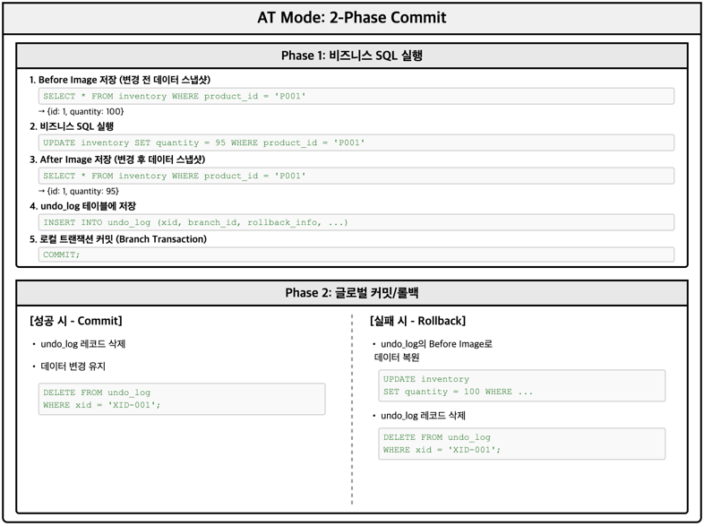
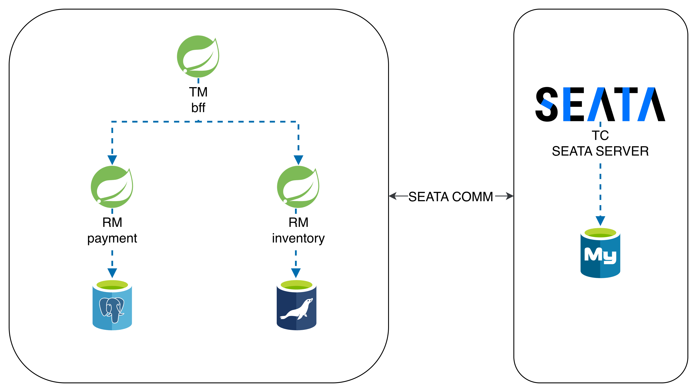
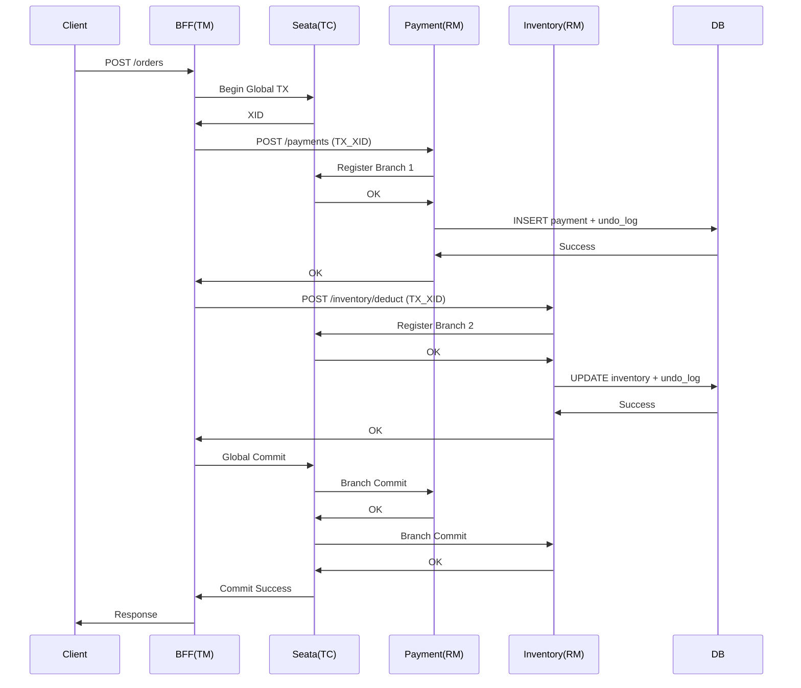
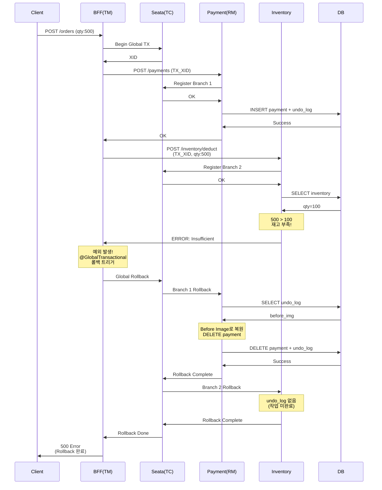

# Apache Seata 분산 트랜잭션 소개

## 세미나 개요

**주제:** 마이크로서비스 환경에서의 분산 트랜잭션 관리
**기술:** Apache Seata 2.3.0 + Spring Boot 3.2.5
**모드:** AT Mode (Automatic Transaction)

---

## 1. Apache Seata 소개

### 1.1 Seata란?

> **S**imple **E**xtensible **A**utonomous **T**ransaction **A**rchitecture

- Alibaba에서 개발, Apache Software Foundation에 기증
- 마이크로서비스 환경을 위한 분산 트랜잭션 솔루션
- 고성능, 비침투적 설계

### 1.2 Seata의 3가지 핵심 컴포넌트

| 이름                               | 배포 형태/위치                                    | 핵심 역할                  | 주요 기능(요약)                                                           |
|----------------------------------| ------------------------------------------- | ---------------------- | ------------------------------------------------------------------- |
| **TC** (Transaction Coordinator) | **독립 서버(Seata Server)**                     | 글로벌 트랜잭션의 “컨트롤 플레인”    | 글로벌 트랜잭션 상태 관리 / 브랜치 트랜잭션 조정 / Commit·Rollback 결정 및 전파              |
| **TM** (Transaction Manager)     | 애플리케이션 내 (예: **BFF Service**)               | 글로벌 트랜잭션의 “시작·종료 지휘”   | 글로벌 트랜잭션 시작·커밋·롤백 요청 / 비즈니스 오케스트레이션 / `@GlobalTransactional` 기반 진입점 |
| **RM** (Resource Manager)        | 각 리소스 서비스 내 (예: **Payment**, **Inventory**) | 로컬 리소스(DB 등)의 “실행 플레인” | 브랜치 트랜잭션 등록·커밋·롤백 / 실제 DB 작업 수행 / `undo_log` 관리                     |


### 1.3 Seata 트랜잭션 모드

| 모드       | 설명                                                                 |
| -------- |--------------------------------------------------------------------|
| **AT**   | DB 작업을 **프록시**로 감싸서 1단계에 `undo_log` 적재 + 로컬 트랜잭션 수행, 2단계에 커밋/롤백 처리 |
| **XA**   | DB 등 리소스가 제공하는 **XA(2PC) 프로토콜**로 브랜치 트랜잭션 제어                       |
| **TCC**  | 비즈니스가 **Try / Confirm / Cancel** 3단계를 직접 구현(예약→확정/취소)              |
| **SAGA** | 각 단계는 로컬 트랜잭션, 실패 시 이전 단계들을 **보상(Compensation)**으로 되돌림             |


**이 세미나에서는 AT Mode에 집중합니다.**

---

## 2. AT Mode 동작 원리

### 2.1 AT Mode 2단계 커밋



### 2.2 undo_log 테이블 구조

```sql
CREATE TABLE undo_log (
    branch_id     BIGINT       NOT NULL,   -- 브랜치 트랜잭션 ID
    xid           VARCHAR(128) NOT NULL,   -- 글로벌 트랜잭션 ID
    context       VARCHAR(128) NOT NULL,   -- 직렬화 방식 (jackson)
    rollback_info BLOB         NOT NULL,   -- Before/After Image (JSON)
    log_status    INT          NOT NULL,   -- 0: 정상, 1: 글로벌 완료
    log_created   TIMESTAMP    NOT NULL,
    log_modified  TIMESTAMP    NOT NULL,
    CONSTRAINT ux_undo_log UNIQUE (xid, branch_id)
);
```

**rollback_info 예시:**
```json
{
  "branchType": "AT",
  "sqlUndoLogs": [{
    "tableName": "inventory",
    "beforeImage": {
      "rows": [{"id": 1, "quantity": 100}]
    },
    "afterImage": {
      "rows": [{"id": 1, "quantity": 95}]
    }
  }]
}
```

---

## 3. XID (Transaction ID) 전파

### 3.1 XID란?

- **글로벌 트랜잭션 식별자**
- 형식: `IP:Port:TransactionId` (예: `192.168.1.100:8091:123456789`)
- 모든 서비스가 동일한 XID를 공유해야 분산 트랜잭션 참여 가능

### 3.2 XID 전파 흐름


---

## 4. 프로젝트 아키텍처

### 4.1 전체 시스템 구성도



### 4.2 Sequence Diagram



### 4.3 Sequence Diagram (롤백 케이스)



**롤백 프로세스 요약:**

| 단계 | 동작 | 설명 |
|------|------|------|
| 1 | Payment 성공 | 결제 레코드 + undo_log 생성 |
| 2 | Inventory 실패 | 재고 부족으로 예외 발생 |
| 3 | TM → TC | 글로벌 롤백 요청 |
| 4 | TC → Payment RM | Branch 1 롤백 명령 |
| 5 | Payment 복원 | undo_log의 Before Image로 DELETE 실행 |
| 6 | TC → Inventory RM | Branch 2 롤백 명령 (작업 없음) |
| 7 | 완료 | 모든 데이터 원상복구 |

---

## 5. 핵심 코드 살펴보기

### 5.1 Transaction Manager (BFF Service)

**OrderService.java** - 글로벌 트랜잭션 시작점
```java
@Service
public class OrderService {

    @GlobalTransactional(name = "create-order", rollbackFor = Exception.class)
    public OrderResponse createOrder(OrderRequest request) {
        String xid = RootContext.getXID();  
        log.info("Starting global transaction, XID: {}", xid);

        try {
            // Step 1: 결제 서비스 호출
            callPaymentService(request);

            // Step 2: 재고 서비스 호출
            callInventoryService(request);

            return OrderResponse.success(xid);
        } catch (Exception e) {
            log.error("Order failed, rolling back. XID: {}", xid);
            throw new RuntimeException("Order failed: " + e.getMessage(), e);
            // 예외 발생 시 Seata가 자동으로 모든 브랜치 롤백
        }
    }
}
```

**SeataXidInterceptor.java** - XID 전파
```java
public class SeataXidInterceptor implements ClientHttpRequestInterceptor {

    @Override
    public ClientHttpResponse intercept(HttpRequest request, byte[] body,
                                         ClientHttpRequestExecution execution) {
        String xid = RootContext.getXID();
        if (xid != null) {
            // HTTP 헤더에 XID 추가
            request.getHeaders().add(RootContext.KEY_XID, xid);
            log.debug("Propagating XID: {} to {}", xid, request.getURI());
        }
        return execution.execute(request, body);
    }
}
```

### 5.2 Resource Manager (Payment/Inventory Service)

**PaymentController.java** - XID 자동 바인딩 (seata-spring-boot-starter 2.x)
```java
@RestController
@RequestMapping("/api/payments")
public class PaymentController {

    @PostMapping
    public ResponseEntity<PaymentResponse> createPayment(@RequestBody PaymentRequest request) {
        // XID는 SeataHttpAutoConfiguration의
        // JakartaTransactionPropagationInterceptor가 자동 바인딩
        log.info("Received payment request, XID: {}", RootContext.getXID());

        try {
            // 비즈니스 로직 실행
            // Seata DataSource Proxy가 자동으로 undo_log 생성
            PaymentResponse response = paymentService.processPayment(request);
            return ResponseEntity.ok(response);
        } catch (Exception e) {
            log.error("Payment processing failed", e);
            return ResponseEntity.badRequest()
                    .body(PaymentResponse.failure(e.getMessage()));
        }
        // unbind는 인터셉터가 자동으로 처리
    }
}
```

> **Note (Seata 2.3.0 기준)**: `seata-spring-boot-starter 2.x`에서는 `SeataHttpAutoConfiguration`이
> `JakartaTransactionPropagationInterceptor`를 자동 등록하여 XID 바인딩/언바인딩을 처리합니다.
> 수동으로 `RootContext.bind()`/`unbind()`를 호출할 필요가 없습니다.
>
> 설정: `seata.client.http.interceptor-enabled=true` (기본값, `matchIfMissing=true`)
>
> ⚠️ **버전 주의**:
> - Seata 2.x + Spring Boot 3.x: 자동 바인딩 지원 (Jakarta EE)
> - Seata 1.x 또는 Spring Boot 2.x: 수동 `WebMvcConfigurer` 구성 필요
> - `spring-cloud-starter-alibaba-seata` 사용 시: 버전 무관 자동 지원

### 5.3 설정 파일

**application.yml** (공통 설정)
```yaml
seata:
  enabled: true
  application-id: ${spring.application.name}
  tx-service-group: my_tx_group
  service:
    vgroup-mapping:
      my_tx_group: default
    grouplist:
      default: localhost:8091  # Seata Server 주소
  registry:
    type: file
  config:
    type: file
```

**application.yml** (RM 추가 설정)
```yaml
seata:
  enable-auto-data-source-proxy: true  # DataSource 자동 프록시
```

---

## 참고 자료

- [Apache Seata 공식 문서](https://seata.apache.org/)
- [Seata GitHub](https://github.com/apache/incubator-seata)

---